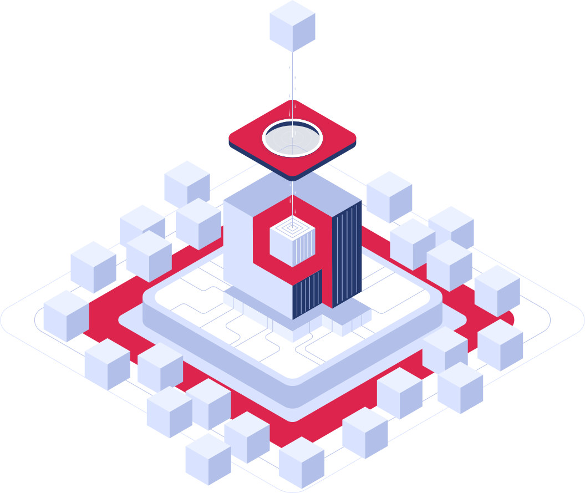

# Qdrant Tutorials

A collection of tutorials and references to get started with [Qdrant](https://qdrant.tech/) vector databases

### [What is Qdrant?](https://qdrant.tech/documentation/overview/)

### [Free forever 1GB cluster](https://login.cloud.qdrant.io/)

### [Intro to Semantic Search](notebooks/intro-to-semantic-search.ipynb)

### [Simple Neural Search API](qdrant-search-api/README.md)

### [Fast Integration with ChatGPT](https://qdrant.tech/articles/chatgpt-plugin/)

